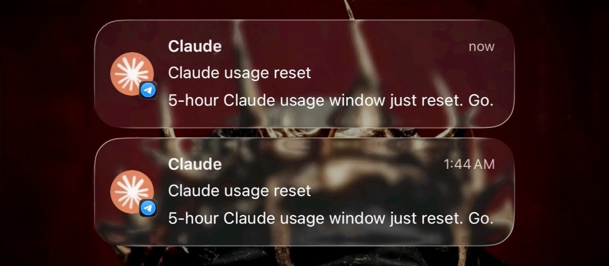
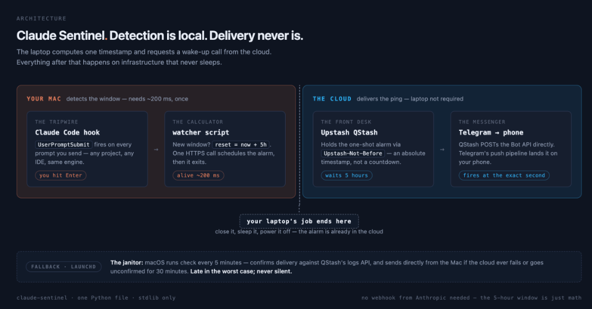
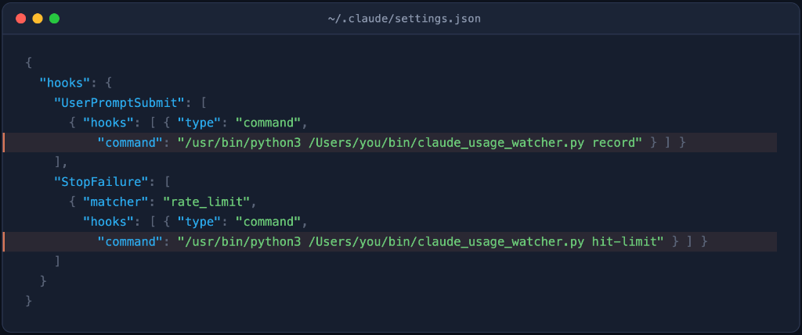
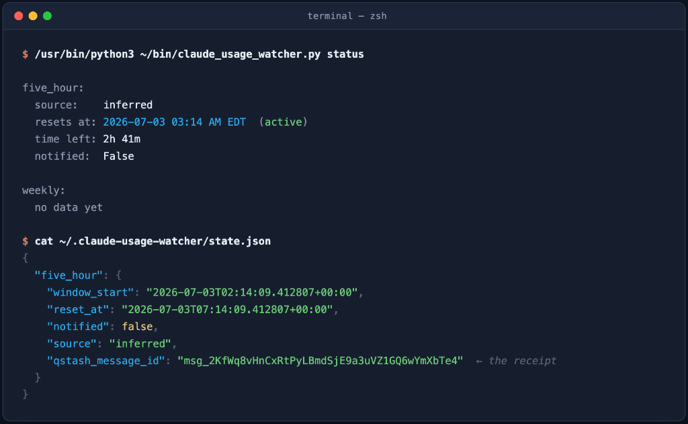

<div align="center">
  <h1>Claude Sentinel</h1>
</div>

<div align="center">
  <h3>Know the instant your Claude usage window resets — even with your laptop closed.</h3>
</div>

<div align="center">
  
  
  
  
</div>

<br>

<div align="center">
  
</div>

<br>

Sentinel watches Claude Code activity on this machine, computes exactly
when your 5-hour usage window resets, and hands delivery off to the cloud
the instant it knows — so the notification arrives on time whether your
laptop is open, asleep, or off.

```bash
./install.sh
```

> [!TIP]
> The in-app/CLI countdown is always the source of truth, not Sentinel. If
> they ever disagree, run `correct five_hour <timestamp>` to reconcile.

## Why use Sentinel?

Anthropic doesn't publish a "your limit just reset" webhook — the only
ground truth is built for humans to read, not machines to poll. Sentinel
closes that gap:

- **Event-driven, not polling** — a Claude Code hook computes the reset
  time the instant a new window opens; nothing runs continuously.
- **Cloud-delivered** — [Upstash QStash](https://upstash.com/docs/qstash)
  fires the push straight to Telegram at the exact second; your laptop is
  out of the loop the moment the alarm is scheduled.
- **Delivery-confirmed** — verifies the message actually reached Telegram
  before considering the job done, with an automatic fallback if it didn't.
- **Self-correcting** — one command reconciles drift the moment you spot
  it against the real countdown.
- **Zero dependencies** — one Python file, standard library only, nothing
  to `pip install`, ever.

```
Claude Code hook  →  claude_usage_watcher.py  →  Upstash QStash  →  Telegram
   (this Mac)          (computes reset_at)        (cloud alarm)      (your phone)
```

<div align="center">
  
</div>

---

## Documentation

- **[SYSTEMDESIGN.md](SYSTEMDESIGN.md)** — every design decision, every
  real bug this hit, and exactly how the QStash/Telegram wiring works
- **[FUTUREWORK.md](FUTUREWORK.md)** — possible extensions, roughly ranked
  by effort vs. value
- Setup, usage, and troubleshooting — below

## Directory layout

```
Claude-Efficiency/
├── README.md                            this file
├── SYSTEMDESIGN.md                       in-depth technical explanation of how this was built
├── FUTUREWORK.md                         possible future improvements/integrations
├── .gitignore
├── claude_usage_watcher.py              the tool itself (record / hit-limit / check / correct / status)
├── install.sh                           deploys the script to ~/bin (see "Why two copies" below)
├── test.sh                              local, side-effect-free test pass (no real network calls)
├── hooks.snippet.json                   the two hook entries to merge into ~/.claude/settings.json
├── claude_usage_watcher_HANDOFF.md      original planning brief this tool was built from, kept for reference
└── launchd/
    └── com.claude-usage-watcher.plist   LaunchAgent that runs `check` every 5 min (fallback only)
```

All commands below are run from the repo root.

### Why two copies of the script exist

This repo is the source of truth and where you edit the script. But the
hooks and the launchd job don't execute it from here — they execute a
deployed copy at `~/bin/claude_usage_watcher.py`. Reason: `~/Desktop` (and
`~/Documents`, `~/Downloads`) are TCC-protected on macOS. A background
`launchd` process trying to read a script under `~/Desktop/...` fails with
a silent `Operation not permitted`, even though your interactive Terminal
reads the same path fine — this bit us once already setting this up.
`~/bin` isn't a protected location, so it sidesteps the issue entirely.

**After editing `claude_usage_watcher.py`, run `./install.sh`** to redeploy
it to `~/bin` — the two copies are not auto-synced.

### Secrets live in one local file, not the repo or the plist

All four credentials (Telegram bot token, Telegram chat ID, QStash token,
QStash base URL) load from `~/.claude-usage-watcher/secrets.env`
(`chmod 600`), read by the script itself at startup — **not** from
environment variables set in the plist or hooks. Reason: Claude Code hooks
and `launchd` don't reliably share the same environment, so relying on
either one to carry secrets is fragile. A fixed local file the script reads
directly works the same way no matter what invoked it.

```bash
# ~/.claude-usage-watcher/secrets.env
CLAUDE_NOTIFIER_TELEGRAM_BOT_TOKEN=123456789:AA...
CLAUDE_NOTIFIER_TELEGRAM_CHAT_ID=987654321
CLAUDE_NOTIFIER_QSTASH_TOKEN=eyJ...
CLAUDE_NOTIFIER_QSTASH_URL=https://qstash-us-east-1.upstash.io
```

This means the checked-in `launchd/*.plist` template needs **no
`EnvironmentVariables` block and no secret substitution at all** — the
installed copy in `~/Library/LaunchAgents/` can be an exact, byte-for-byte
copy of the repo template.

State (separate from secrets) also lives outside this repo, at
`~/.claude-usage-watcher/`:

| File | Contents |
|---|---|
| `state.json` | current `five_hour` / `weekly` tracked windows, including each one's active `qstash_message_id` |
| `state.lock` | empty lock file (`flock`) serializing concurrent reads/writes of `state.json` — safe to ignore |
| `secrets.env` | the four credentials above, `chmod 600` |
| `stop_failure_events.jsonl` | every raw `StopFailure` payload ever seen, one JSON object per line |
| `launchd.out.log` / `launchd.err.log` | stdout/stderr from the scheduled `check` runs |

## Setup

### 0. Personalize the templates

`hooks.snippet.json` and the launchd plist ship with a
`/Users/YOUR_USERNAME` placeholder — launchd and Claude Code hooks both
need absolute paths, so they can't use `~` or `$HOME` themselves. One
command fills in *your* home directory everywhere it's needed:

```bash
sed -i '' "s|/Users/YOUR_USERNAME|$HOME|g" hooks.snippet.json launchd/com.claude-usage-watcher.plist
```

Run it once after cloning; every path below then matches your system.

### 1. Deploy the script to `~/bin`

```bash
./install.sh
```

See [Why two copies of the script exist](#why-two-copies-of-the-script-exist)
above. Re-run this any time you edit `claude_usage_watcher.py`.

### 2. Run the test pass

```bash
./test.sh
```

Confirms fresh-window inference, `check --dry-run` previewing without
mutating state, and `hit-limit` logging + `confirmed_blocked_at` — against
a scratch state file and with secrets deliberately unset, so it never
touches real state or makes a real network call regardless of what's
configured on the machine running it.

### 3. Register the Claude Code hooks

Merge the two hook entries from `hooks.snippet.json` into
`~/.claude/settings.json` under its `hooks` key. **Merge, don't overwrite** —
your `settings.json` likely has other config (MCP servers, `effortLevel`,
etc.) that must survive untouched.

```json
{
  "hooks": {
    "UserPromptSubmit": [
      { "hooks": [ { "type": "command",
          "command": "/usr/bin/python3 /Users/YOUR_USERNAME/bin/claude_usage_watcher.py record" } ] }
    ],
    "StopFailure": [
      { "matcher": "rate_limit",
        "hooks": [ { "type": "command",
          "command": "/usr/bin/python3 /Users/YOUR_USERNAME/bin/claude_usage_watcher.py hit-limit" } ] }
    ]
  }
}
```

Note the absolute `/usr/bin/python3` rather than a bare `python3` — see
[Known gaps](#known-gaps) for why that matters.



### 4. Create a Telegram bot and get your chat ID

1. In Telegram, message **@BotFather** → `/newbot` → follow the prompts.
   You'll get back a bot token that looks like `123456789:AA...`.
2. Search for your new bot's username and send it any message (e.g. "hi") —
   this opens the chat so Telegram has somewhere to deliver to.
3. Fetch your chat ID:
   ```bash
   curl -s "https://api.telegram.org/bot<YOUR_TOKEN>/getUpdates" | python3 -m json.tool
   ```
   Look for `result[0].message.chat.id`.

### 5. Create an Upstash QStash account and get your token

1. Sign up at [console.upstash.com](https://console.upstash.com) (free
   tier, no card required).
2. Open **QStash** in the sidebar → copy `QSTASH_TOKEN` and the
   region-specific `QSTASH_URL` shown on that page. Use the region-specific
   URL, not the generic `qstash.upstash.io` gateway — the generic one
   returned a "user not found in this region" error for a fresh account in
   testing here.

### 6. Write the secrets file

```bash
mkdir -p ~/.claude-usage-watcher
cat > ~/.claude-usage-watcher/secrets.env <<'EOF'
CLAUDE_NOTIFIER_TELEGRAM_BOT_TOKEN=<your bot token>
CLAUDE_NOTIFIER_TELEGRAM_CHAT_ID=<your chat id>
CLAUDE_NOTIFIER_QSTASH_TOKEN=<your qstash token>
CLAUDE_NOTIFIER_QSTASH_URL=<your qstash region url>
EOF
chmod 600 ~/.claude-usage-watcher/secrets.env
```

**Never commit this file or paste real values into this repo** — it's
already covered by `.gitignore` (`.env`), but `secrets.env` itself lives
entirely outside the repo, under `~/.claude-usage-watcher/`, by design.

### 7. Load the launchd fallback job

```bash
cp launchd/com.claude-usage-watcher.plist ~/Library/LaunchAgents/
launchctl bootstrap gui/$(id -u) ~/Library/LaunchAgents/com.claude-usage-watcher.plist
launchctl list | grep claude-usage-watcher   # should show it loaded, exit status 0
```

No secret substitution needed — see
[Secrets live in one local file](#secrets-live-in-one-local-file-not-the-repo-or-the-plist)
above. (`launchctl load` still works but is the deprecated form;
`bootstrap` is the modern equivalent.)

To reload after editing the plist:

```bash
launchctl bootout gui/$(id -u)/com.claude-usage-watcher 2>/dev/null
launchctl bootstrap gui/$(id -u) ~/Library/LaunchAgents/com.claude-usage-watcher.plist
```

### 8. Real end-to-end test

```bash
/usr/bin/python3 claude_usage_watcher.py correct five_hour "$(/usr/bin/python3 -c "from datetime import datetime,timedelta,timezone;print((datetime.now(timezone.utc)+timedelta(minutes=2)).isoformat())")"
```

Check `~/.claude-usage-watcher/state.json` for a populated
`qstash_message_id` — that confirms the cloud alarm was scheduled
successfully. A real push should land on your phone within ~2 minutes,
independent of `launchd` (you can `launchctl bootout` the job first to
prove it — that's how this was verified originally).

## Usage

| Command | When it runs | What it does |
|---|---|---|
| `record` | `UserPromptSubmit` hook | Starts a new 5-hour window if none is active and schedules its QStash alarm. No-op otherwise — usage volume never moves the reset time. |
| `hit-limit` | `StopFailure(rate_limit)` hook | Logs the raw payload, marks `confirmed_blocked_at`; if it recognizes a real reset field, cancels the old alarm and schedules a new one. |
| `check [--dry-run]` | launchd, every 5 min | Fallback + status sync — confirms actual delivery via QStash's logs API before marking `notified=True`; sends directly if delivery fails/times out or no alarm was ever scheduled. `--dry-run` previews without mutating state. |
| `correct <five_hour\|weekly> <ISO8601>` | manual, whenever you see a real value | Overwrites the tracked reset time with ground truth; cancels any existing alarm and schedules a new one. |
| `status` | manual | Human-readable dump of both tracked windows. |

Running `status` displays a clean, human-readable summary of your tracked windows, or you can check the raw `state.json` file:



## Known gaps

- **`StopFailure` payload schema is unconfirmed.** `hit-limit` searches the
  whole payload recursively (any nesting depth, case/hyphen-insensitive)
  for `reset_at` / `resets_at` / `reset_time` / `retry_after_ms` /
  `retry_after_seconds` / `retry_after`-style keys, and accepts either ISO
  8601 strings or Unix epoch numbers — but the real field *names* are still
  a guess. The next time a real rate limit hits during normal use, read
  `stop_failure_events.jsonl` (or the "no recognized field" note it prints
  to stderr, which lists every key it saw), find the real field names, and
  update `RESET_TIMESTAMP_KEYS`/`RETRY_AFTER_*_KEYS` in
  `claude_usage_watcher.py`.
- **Weekly cap mechanics are unknown.** Only ever set via `correct weekly`;
  never inferred. Feed it real observed values over time to eventually
  figure out whether it's rolling or fixed-boundary.
- **Blind to claude.ai web/mobile usage.** If you split usage across
  surfaces, the 5-hour inference can drift from reality until corrected.
- **A bare `python3` can silently break HTTPS calls.** A `python.org`
  installer build of Python (as opposed to Apple's `/usr/bin/python3`) ships
  with its own cert bundle that isn't initialized until you run its
  `Install Certificates.command` — until then, any `urllib` HTTPS call
  fails with `CERTIFICATE_VERIFY_FAILED`. This bit `test.sh` during
  development. Every invocation in this repo (hooks, plist, test.sh) is
  pinned to `/usr/bin/python3` specifically to avoid depending on whatever
  `python3` happens to resolve first on `$PATH`.
- **`python3 -c "..."` one-liners can fail under a TCC-protected working
  directory, even when running the actual script from the same place works
  fine.** Python inserts different things into `sys.path[0]` depending on
  invocation style: running a script file inserts *that script's*
  directory, but `python3 -c "..."` inserts the current working directory.
  If your shell's `cwd` happens to be under `~/Desktop`/`~/Documents`/
  `~/Downloads` when you run an inline one-liner (like the timestamp
  helpers in this README's setup steps), Python's own startup import scan
  can hit the same TCC wall described above — even though hooks and
  `launchd` are unaffected (they always invoke the real `.py` file, never
  `-c`). If a copy-pasted one-liner throws a `PermissionError` during
  import, `cd` somewhere outside those three folders (e.g. `/tmp`) first.

## Troubleshooting

```bash
# is the job loaded?
launchctl list | grep claude-usage-watcher

# force a run right now, bypassing the 5-min interval
launchctl start com.claude-usage-watcher

# check what actually happened on the last few ticks
tail -f ~/.claude-usage-watcher/launchd.out.log ~/.claude-usage-watcher/launchd.err.log

# current tracked state, including qstash_message_id per window
cat ~/.claude-usage-watcher/state.json
/usr/bin/python3 claude_usage_watcher.py status
```

**No `qstash_message_id` in `state.json` after `record`/`correct`:**
scheduling failed silently from the caller's perspective (hooks shouldn't
crash your Claude Code session) but logs a warning to stderr — check
`~/.claude-usage-watcher/launchd.err.log` or run the command manually in a
terminal to see it. Usually a missing/wrong value in `secrets.env`, or the
generic (non-regional) QStash URL — see step 5 above.

**`launchd.err.log` shows `Operation not permitted` opening the script:**
you're pointing the plist at a script under `~/Desktop`, `~/Documents`, or
`~/Downloads` — all TCC-protected on macOS, silently blocking background
processes even though Terminal can read the same file fine. Point
`ProgramArguments` at the `~/bin` deployed copy instead (run `./install.sh`
first if you haven't).

**`launchd.err.log` shows `CERTIFICATE_VERIFY_FAILED`:** see the bare
`python3` note in [Known gaps](#known-gaps) — make sure `ProgramArguments`
uses `/usr/bin/python3`, not a bare `python3`.

**Push arrives but shows no popup — check the app is backgrounded, not
foregrounded** when testing (Telegram, like most apps, doesn't banner its
own foreground chat). If it still doesn't show as a real notification with
the app closed, check the OS notification permission for the Telegram app
specifically, and any Focus/Do Not Disturb modes.

## Uninstall

```bash
launchctl bootout gui/$(id -u)/com.claude-usage-watcher
rm ~/Library/LaunchAgents/com.claude-usage-watcher.plist
rm ~/bin/claude_usage_watcher.py
# then remove the two hook entries from ~/.claude/settings.json by hand
rm -rf ~/.claude-usage-watcher   # also removes secrets.env
```

Also worth deleting the QStash token from the Upstash console and revoking
the Telegram bot (message @BotFather → `/deletebot`) if you're tearing this
down for good.

## Architecture history

This tool went through two real pivots worth knowing about if you're
extending it:

1. **ntfy.sh → Telegram.** Originally used ntfy.sh (no account needed,
   simplest possible setup). On iOS, pushes reached the app's in-app list
   but never surfaced a system notification — not fixable via permission
   toggles or priority headers, tracked back to ntfy's Firebase/APNs relay
   being less battle-tested than a mainstream app's push pipeline. Telegram
   worked immediately.
2. **Local polling → cloud one-shot timer.** Originally, notification
   delivery was `launchd` polling `check` every 5 minutes and sending
   directly. That only works while the Mac is awake — a closed laptop meant
   the notification arrived late, whenever the Mac was next opened,
   undercutting the entire point of the tool. Moved delivery to Upstash
   QStash: `record`/`correct`/`hit-limit` schedule a one-shot delayed
   message straight to the Telegram Bot API at the exact reset moment, so
   delivery no longer depends on this machine's power state at all. Local
   `check` was demoted to a fallback (for when scheduling failed) plus
   local status bookkeeping, deliberately structured so it never fires the
   same notification QStash already sent.
